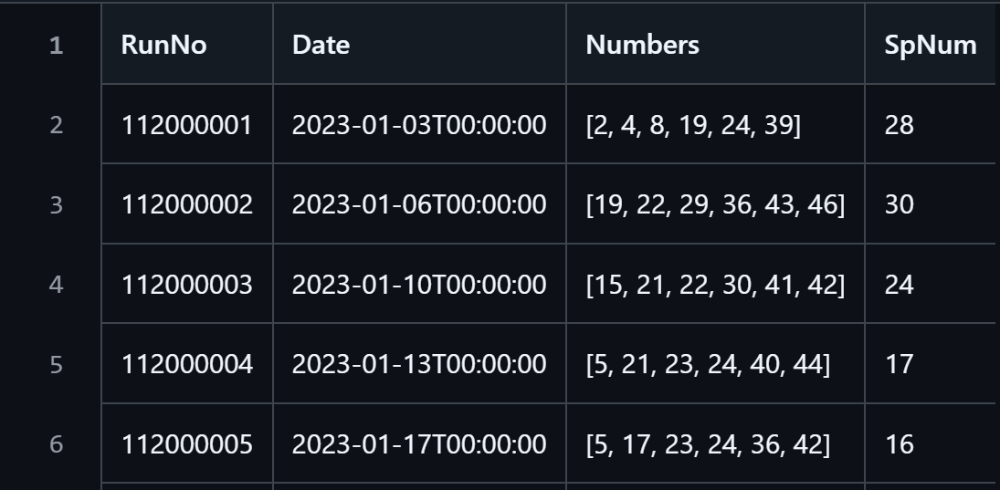

```{r setup, include=FALSE}
knitr::opts_chunk$set(echo = TRUE)
```

# 大樂透獎號關聯式分析


```{r load_pkg, eval=TRUE, echo=TRUE, message=FALSE, warning=FALSE}
library(arules)
library(arulesViz)
```

資料為透過專用 python 爬蟲套件 https://github.com/stu01509/TaiwanLotteryCrawler 爬取 2023 年 01 月 01 日起至 2025 年 03 月 07 日的大樂透開獎獎號，爬下資料儲存於 https://github.com/PingYangChen/BDA_Course_R_Code/blob/main/sample_data/lotto_2023-202503037.csv。

{fig.align='center'}

## 讀取資料並整理成關聯式分析所需格式
```{r read_lotto, eval=TRUE, echo=TRUE}
# Read data from the github link
url <- 'https://raw.githubusercontent.com/PingYangChen/BDA_Course_R_Code/refs/heads/main/sample_data/lotto_2023-202503037.csv'
df <- read.csv(url)
# Display a few rows of the dataframe 
head(df, 6)
```

從 **arules** 的範例對照，在此的購物車資料定義應為

- 期別：transaction ID (tid)
- 獎號：item

且 **arules** 需要的 `dataframe` 格式如下
```{r observe_data, eval=TRUE, echo=TRUE}
data.frame(tid = rep("112000001", 6), item = c(2, 4, 8, 19, 24, 39))
```
每期為一個單位的購物車（transaction ID），每期開出六個號碼（items），則每期資料應在 `dataframe` 中佔 6 列。

觀察原始資料的第一筆獎號 `r df$獎號[1]`，此原為字串，前後有中括號，數字已逗號分隔。
需要從字串移除中括號，並分離出六個整數。

- 移除中括號：使用字串處理函數 `strspilt`，依次將左中括號 `\\[`、右中括號 `\\]` 分離。

```{r observe_data0, eval=TRUE, echo=TRUE}
tmp0 <- strsplit(df$獎號[1], "\\[")
print(tmp0)
```
```{r observe_data1, eval=TRUE, echo=TRUE}
tmp1 <- strsplit(tmp0[[1]][2], "\\]")
print(tmp1)
```
- 拆解逗號分離：使用字串處理函數 `strspilt`，以逗號 `,` 作為切分點切割字串。

```{r observe_data2, eval=TRUE, echo=TRUE}
tmp2 <- strsplit(tmp1[[1]][1], ",")
print(tmp2)
```

- 整數化：使用函數 `as.integer`，以逗號 `,` 將六個整數字串串列轉為整數串列。

```{r observe_data3, eval=TRUE, echo=TRUE}
as.integer(tmp2[[1]])
```

將以上步驟整合成為可調用的函數
```{r define_splitnum_func, eval=TRUE, echo=TRUE}
SplitNumbers <- function(num_list) {
  tmp0 <- strsplit(num_list, "\\[")
  tmp1 <- strsplit(tmp0[[1]][2], "\\]")
  tmp2 <- strsplit(tmp1[[1]][1], ",")
  out <- as.integer(tmp2[[1]])
  return(out)
}
```

建立購物車資料，滿足 **arules** 需要的 `dataframe` 
```{r define_trans_df, eval=TRUE, echo=TRUE}
item_vec <- tid_vec <- c()
for (i in 1:nrow(df)) {
  itmp <- SplitNumbers(df$獎號[i])
  item_vec <- c(item_vec, itmp)
  tid_vec <- c(tid_vec, rep(df$期別[i], length(itmp)))
}
df_trans <- data.frame(tid = tid_vec, item = item_vec)
```

最後將此 `dataframe` 改為 `"transactions"` 格式，即完成資料前處理。
```{r define_arules_df, eval=TRUE, echo=TRUE}
df_arules <- as(split(df_trans$item, df_trans$tid), "transactions")
inspect(head(df_arules, n = 6))
```
## 建立關聯式規則
```{r make_rules, eval=TRUE, echo=TRUE}
rules <- apriori(df_arules, 
                 parameter = list(
                   support = 0.01,   # minimal support of an item set
                   confidence = 0.5, # minimal confidence of rules/association hyperedges
                   minlen = 1 # minimal number of items per item set
                 ))
```


```{r insp_rules_hide, eval=TRUE, echo=FALSE}
# Display the top 3 support rules
out_hide <- inspect(head(rules, n = 5, by = "support"))
```

`r out_hide[1]`

```{r insp_rules, eval=TRUE, echo=TRUE}
# Display the top 3 support rules
inspect(head(rules, n = 10, by = "support"))
```